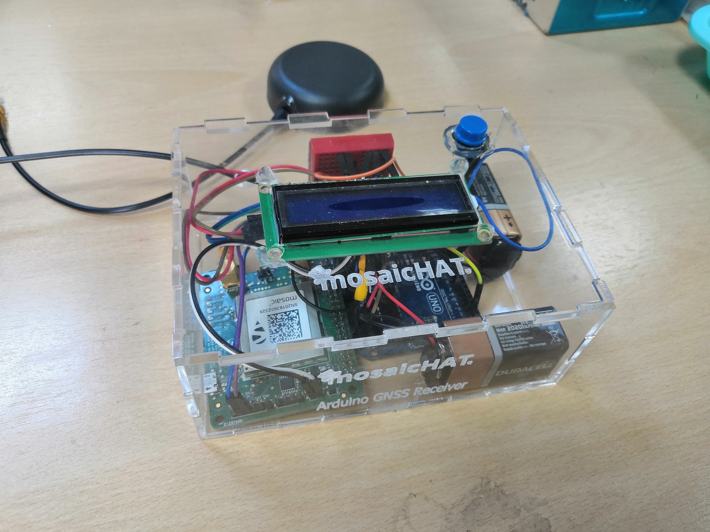
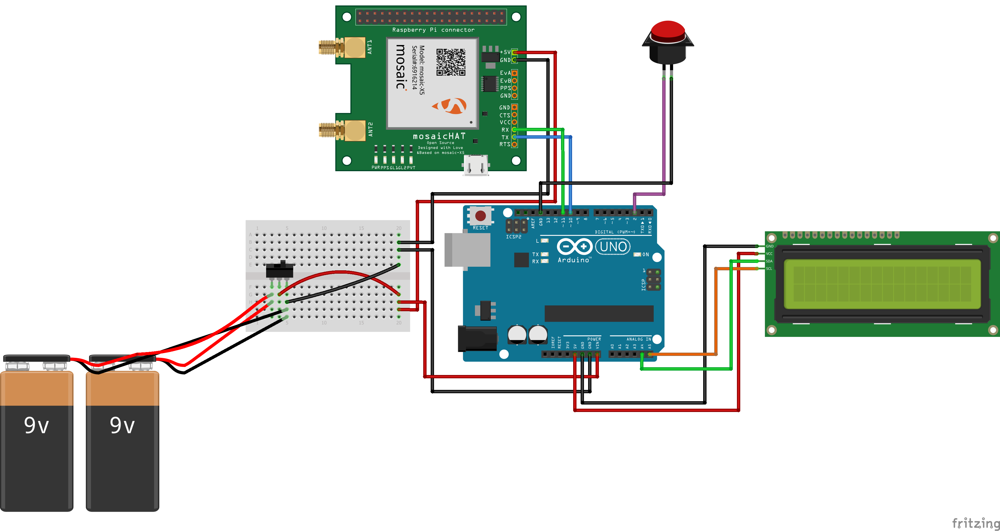

# mosaicHAT Arduino receiver

A basic GPS/GNSS receiver based on mosaicHAT and Arduino. The Arduino code reads GPS/GNSS data (NMEA format) messages from mosaicHAT, a Raspberry Pi compatible PCB based on Septentrio mosaic-X5, and shows desired data on LCD display.

## Design
The code is based on the following connections:

## mosaic-X5 configuration
The Arduino program expects NMEA GGA messages from mosaicHAT serial (COM2). To configure mosaic-X5, connect the board to PC via USB and open mosaic webUI on default address **"192.168.3.1"**
 
- Go to the **Communication** tab and choose **Serial**.
- Change the baud rate of **COM2** to **9600**.
- Click Ok for changes to take effect.
- Go to **NMEA/SBF Out** and choose **New NMEA Stream**.
- Select **Serial** connection type then **COM2** as connection/port.
- Keep the default interval **(1 sec)** and select **GGA** as a message to output.
- Click Ok for changes to take effect.
- Now a popup message will ask if you would like to save the **current configuration as a boot configuration**. Choose Save.

## Check the project on Instructables

All steps of making the project are available on instructables! Check: (https://www.instructables.com/Building-a-GNSS-Receiver-Using-MosaicHAT-and-Ardui/)
